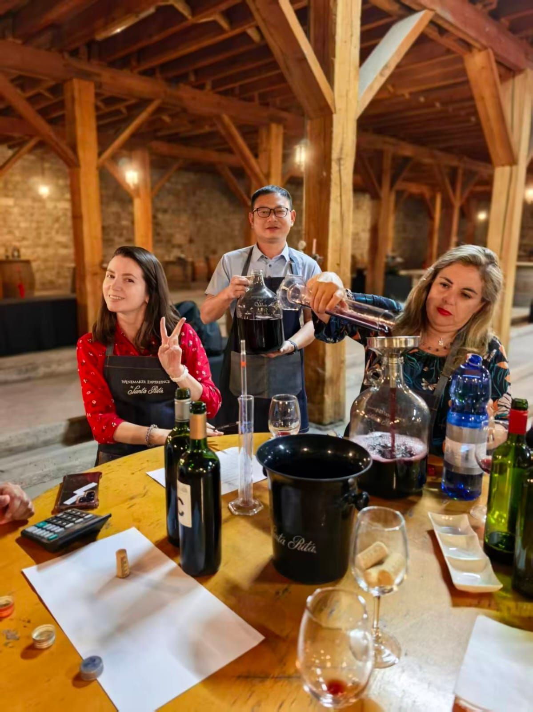
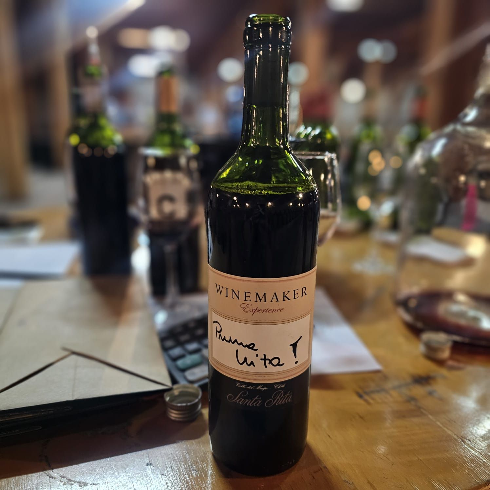

# Instrucciones para las Imágenes de LinkedIn

## 📸 Dónde colocar las imágenes

Coloca las imágenes de la publicación de LinkedIn en la carpeta:
```
assets/images/
```

## 📝 Nombres de archivos requeridos

Para que las imágenes se muestren correctamente, deben tener estos nombres exactos:

1. **Imagen principal (grande, izquierda):**
   - Nombre: `linkedin-vina-1.jpg`
   - Descripción: Grupo de personas en la bodega de vino con barriles
   - Ubicación: `assets/images/linkedin-vina-1.jpg`

2. **Imagen secundaria (pequeña, arriba derecha):**
   - Nombre: `linkedin-vina-2.jpg`
   - Descripción: Degustación de vino con personas alrededor de una mesa
   - Ubicación: `assets/images/linkedin-vina-2.jpg`

3. **Imagen terciaria (pequeña, abajo derecha):**
   - Nombre: `linkedin-vina-3.jpg`
   - Descripción: Botella de vino con etiqueta "Winemaker Pruna Vita"
   - Ubicación: `assets/images/linkedin-vina-3.jpg`

## 🖼️ Especificaciones recomendadas

- **Formato:** JPG o PNG
- **Tamaño recomendado:**
  - Imagen principal: 800x800px o mayor (se ajustará automáticamente)
  - Imágenes secundarias: 400x400px o mayor
- **Peso:** Intenta que cada imagen pese menos de 500KB para mejor rendimiento

## ✅ Pasos a seguir

1. **Prepara las 3 imágenes** de la visita a Viña Santa Rita
2. **Renombra los archivos** con los nombres exactos indicados arriba
3. **Copia las imágenes** a la carpeta `assets/images/`
4. **Verifica** que los nombres sean exactamente:
   - `linkedin-vina-1.jpg`
   - `linkedin-vina-2.jpg`
   - `linkedin-vina-3.jpg`

## 🔄 Si usas otros nombres

Si prefieres usar otros nombres de archivo, deberás editar el archivo `index.html` y cambiar las rutas en las líneas:

```html
<!-- Línea ~440 -->



```

## ⚠️ Nota importante

Si las imágenes no se encuentran, se mostrará un mensaje "Imagen no encontrada". Asegúrate de que:
- Los nombres de archivo sean exactos (incluyendo mayúsculas/minúsculas)
- Las imágenes estén en la carpeta `assets/images/`
- Las extensiones de archivo sean correctas (.jpg, .jpeg, .png)
